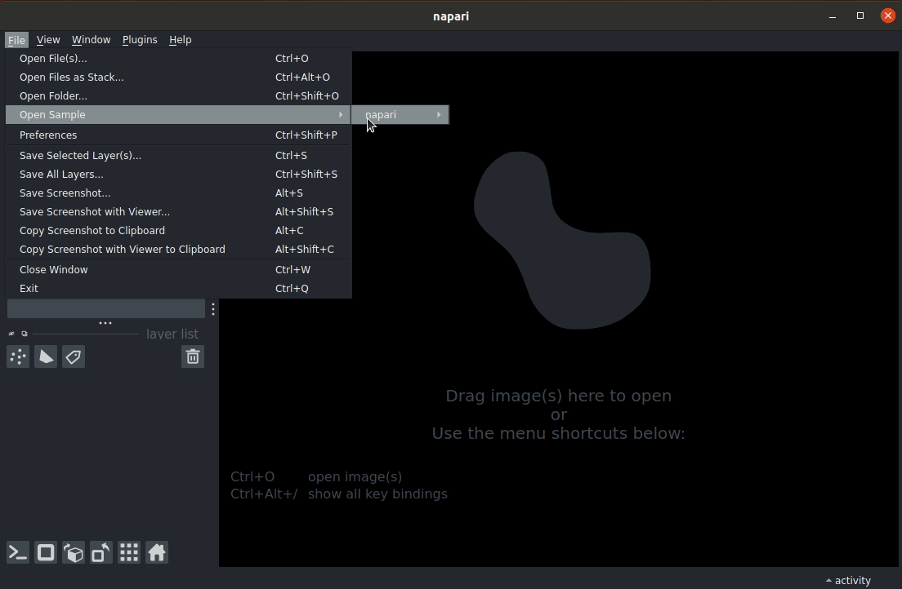
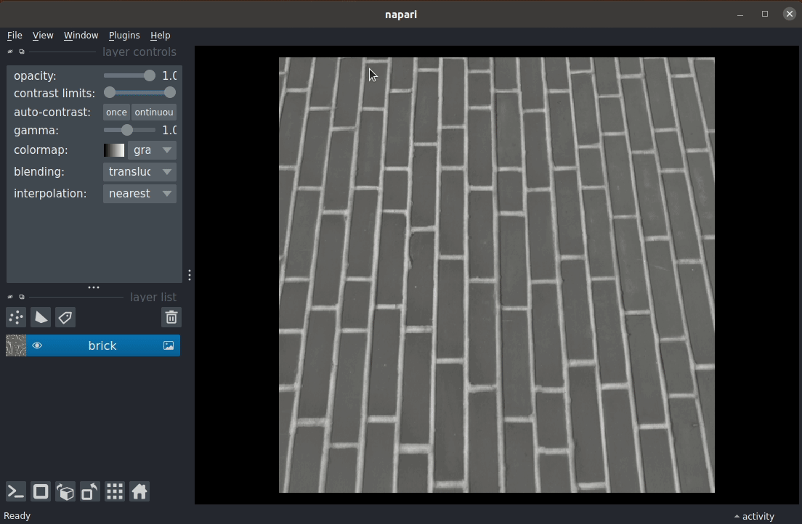

# napari-imagej

### A [napari] plugin for access to [ImageJ2]

[](https://github.com/imagej/napari-imagej/raw/main/LICENSE)
[](https://pypi.org/project/napari-imagej)
[](https://python.org)
[](https://github.com/imagej/napari-imagej/actions)
[](https://codecov.io/gh/imagej/napari-imagej)
[](https://napari-hub.org/plugins/napari-imagej)

**napari-imagej** aims to provide access to all [ImageJ2] functionality through the [napari] graphical user interface. It builds on the foundation of [PyImageJ], a project allowing ImageJ2 access from Python.

See the [project roadmap](https://github.com/orgs/imagej/projects/2), still under construction.

## With napari-imagej, you can access:
* [ImageJ2 Commands] - 100+ image processing algorithms
* [ImageJ Ops] - 500+ *functional* image processing algorithms
* [SciJava Scripts] - migrated from Fiji or ImageJ2, or written yourself!

## Installation

Currently, the only way to install napari-imagej is by downloading this repository. You can then use [conda] to install the environment. We prefer using [mamba] over conda for drastically shorter setup times:

    conda install mamba -n base -c conda-forge
    mamba env create -f environment.yml
    pip install -e .

Once napari-imagej is ready for an initial release, it will be installable from [PyPI] and conda-forge.

To start napari with napari-imagej, activate the conda environment and run `napari`:

    conda activate napari-imagej
    napari

## Usage

### A simple example

With napari-imagej installed, you can access it through napari's `Plugins` menu. Clicking `napari-imagej` will show the main napari-imagej widget.

Once the napari-imagej widget has loaded, typing keywords into the searchbar will display reults in the list below.

Selecting a result will show buttons at the bottom of the widget for executing that functionality. Of importance are the `Run` and `Widget` buttons, *both used to run the selected algorithm*:
* The `Run` button launches a *modal* dialog prompting the user for inputs. Clicking the `OK` button will run the functionality with the selected inputs.
  * Best choice for single function executions, as the dialog only persists for the single execution.
* The `Widget` button launches a *new napari widget* prompting the user for inputs. Clicking the `Run` button will run the functionality with the selected inputs
  * Best choices for experimentation, as the widget will persist until closed by the user.




### Running your own [SciJava Scripts]

napari-imagej is able to automatically detect and expose user-written SciJava scripts. To discover these scripts, they must be located in a *subdirectory* of a `scripts` directory relative to the location where napari is lauched.

For example, we might write this SciJava script, named, `scripts/examples/Connected_Components_Analysis.py`, in Jython:
```jython
#@ Img input
#@ OpService ops
#@output net.imglib2.roi.labeling.ImgLabeling segmentation

inverted = ops.run("copy.img", input)
ops.run("image.invert", inverted, input)

from net.imglib2.algorithm.labeling.ConnectedComponents import StructuringElement

thresholded = ops.run("threshold.otsu", inverted)

segmentation = ops.run("labeling.cca", thresholded, StructuringElement.FOUR_CONNECTED)
```
We can then run it in napari-imagej, **if napari is launched from the parent of the aforementioned `directory`**: 



## Troubleshooting

### napari-imagej does not appear in the Plugins menu of napari!

[npe2] is a useful tool for validating a napari plugin's setup. When running napari-imagej from a [conda] environment, it is easily installed through [conda-forge]:

    mamba install npe2 -n napari-imagej -c conda-forge
    npe2 validate napari-imagej

If `npe2 validate` returns an error, this indicates that napari-imagej was not installed correctly.

### The search bar is disabled with the message "Initializing ImageJ..."

Since napari-imagej is calling Java code under the hood, it must launch a Java Virtual Machine (JVM). The JVM is not launched until the user starts napari-imagej. As we cannot search Java functionality *until the JVM is running*, the search bar is not enabled until the JVM is ready.

The first launch of napari-imagej can take significantly longer than subsequent launches while the underlying framework downloads the Java artifacts needed to run ImageJ2. **Downloading these libraries can take minutes**. These libraries are cached, however, so subsequent launches should not take more than a couple of seconds.

## Contributing

Contributions are welcome! When making changes to napari-imagej, please instead use a new conda environment derived from the file `dev-environment.yml`. This environment will provides developer tools on top of the libraries needed to run napari-imagej

    conda install mamba -n base -c conda-forge
    mamba env create -f dev-environment.yml
    pip install -e .

The resulting environment, `napari-imagej-dev`, **must be activated** for napari-imagej to appear in the Plugins menu. You can start napari *with napari-imagej* using the following:

    conda activate napari-imagej-dev
    napari

**Once you've made changes**, please lint your code with [black], flake your code with [flake8], and sort your imports with [isort].

Finally, file a PR! 

## License

Distributed under the terms of the [BSD-3] license,
"napari-imagej" is free and open source software

## Issues

If you encounter any problems, please [file an issue] along with a detailed description.


[Apache Software License 2.0]: https://www.apache.org/licenses/LICENSE-2.0
[black]: https://github.com/psf/black
[BSD-3]: https://opensource.org/licenses/BSD-3-Clause
[Cookiecutter]: https://github.com/audreyr/cookiecutter
[cookiecutter-napari-plugin]: https://github.com/napari/cookiecutter-napari-plugin
[conda]: https://docs.conda.io/
[conda-forge]: https://conda-forge.org/
[file an issue]: https://github.com/imagej/napari-imagej/issues
[flake8]: https://flake8.pycqa.org/
[GNU GPL v3.0]: https://www.gnu.org/licenses/gpl-3.0.txt
[GNU LGPL v3.0]: https://www.gnu.org/licenses/lgpl-3.0.txt
[ImageJ2]: https://imagej.net/software/imagej2
[ImageJ2 Commands]: https://github.com/imagej/imagej-plugins-commands
[ImageJ Ops]: https://imagej.net/libs/imagej-ops
[isort]: https://pycqa.github.io/isort/
[mamba]: https://mamba.readthedocs.io/
[MIT]: https://opensource.org/licenses/MIT
[Mozilla Public License 2.0]: https://www.mozilla.org/media/MPL/2.0/index.txt
[napari]: https://github.com/napari/napari
[npe2]: https://github.com/napari/npe2
[pip]: https://pypi.org/project/pip/
[PyImageJ]: https://github.com/imagej/pyimagej
[PyPI]: https://pypi.org/
[SciJava Scripts]: https://imagej.net/scripting
[tox]: https://tox.readthedocs.io/
