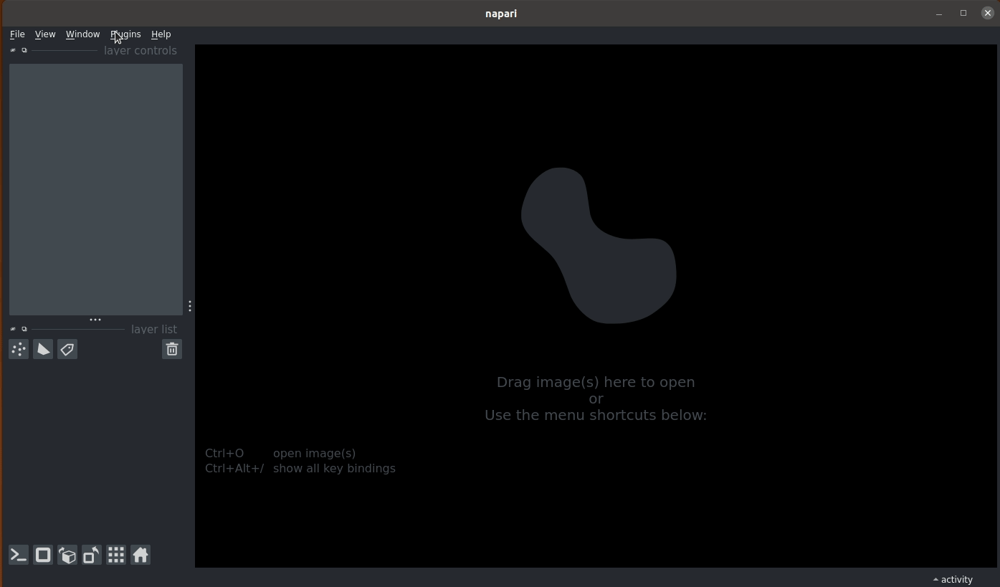

=============
Configuration
=============

This document assumes familiarity with napari_.

Starting napari-imagej
----------------------

With napari running, napari-imagej can be found through ``Plugins->ImageJ2 (napari-imagej)``.

Once triggered, napari-imagej will start up the JVM, and then the ImageJ2 gateway. This setup can take a few seconds, and is complete when the napari-imagej searchbar is cleared and enabled.

**On the first initialization, napari-imagej must download an ImageJ2 distribution. This download can take minutes, depdending on the user's bandwidth.**

Once napari-imagej is fully initilized, users should proceed to the `Usage <./Usage.html>`_ page.

**Note**: napari-imagej always downloads the latest version of ImageJ2_, along with classic ImageJ functionality. To launch a *different* ImageJ2 distribution, such as Fiji_, please see the `Configuration <./Configuration.html>`_ page

.. _Fiji: https://imagej.net/software/fiji/
.. _ImageJ2: https://imagej.net/software/imagej2/
.. _napari: https://napari.org