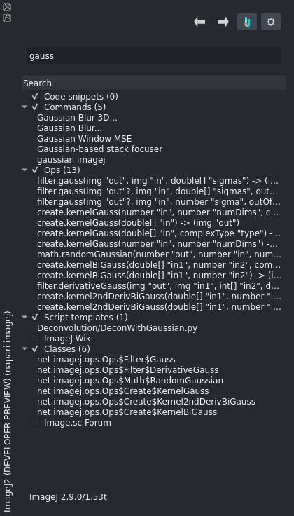
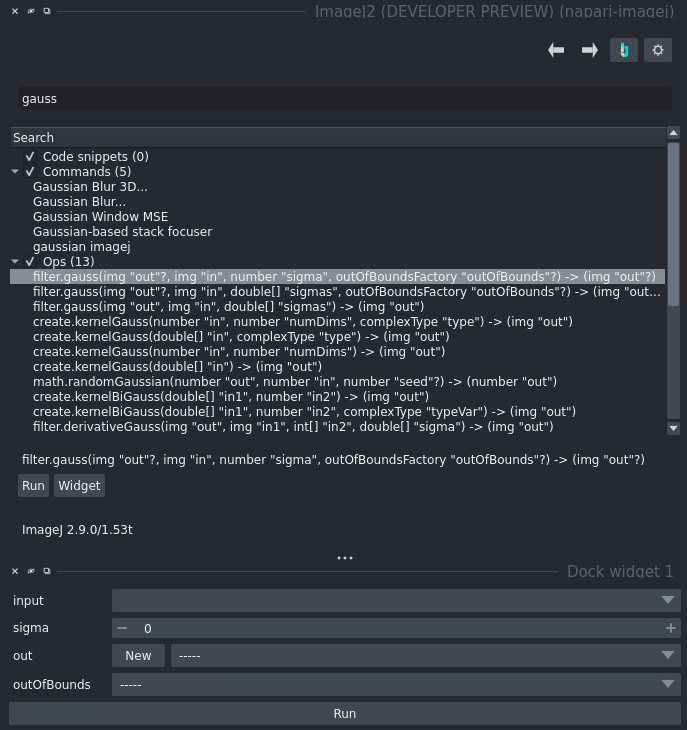
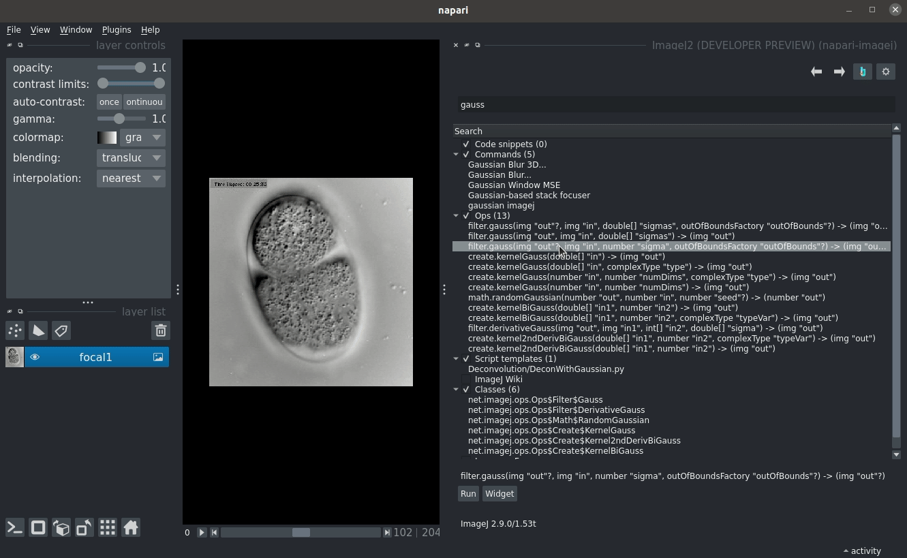

Image Processing with ImageJ Ops (headless)
===========================================

The `ImageJ Ops`_ project contains hundreds of algorithms for module image processing, and is shipped with every ImageJ2 installation. This document explains how to use ImageJ Ops from the napari interface.

Ops, explained
--------------

Ops are reusable, stateless algorithms, having:

* A name, describing the algorithm that the Op follows. Example names include ``math.add``, and ``filter.gauss``.

* A functional type. Most Ops fall into one of two types:

  * ``Function``\s store output in a new napari ``Layer`` upon every execution, maximizing convenience.

  * ``Computer``\s store computational results in a storage buffer, usually an existing napari ``Layer`` *passed by the user*. Making use of shared memory for zero-copy data transfer, ``Computer``\s maximize speed.

* A set of input parameters. Optional parameters can be identified by a trailing ``?``

* A set of return types. Some Ops can run as either a ``Function`` or as a ``Computer`` passing the tradeoff of convenience and speed to the user; these Ops append a trailing ``?`` to their outputs.

A simple gaussian Blur
----------------------

A `gaussiam blur <https://en.wikipedia.org/wiki/Gaussian_blur>`_ is easily performed in ImageJ Ops.

Ops are searchable directly from the napari-imagej search bar. Therefore, looking for a gaussian blur is as simple as typing ``gauss`` into the search bar:

From this version of ImageJ Ops, we can see three different Gaussian Blur Ops. Let's look at the first one:

``filter.gauss(img "out"?, img "in", number "sigma", outOfBoundsFactory "outOfBounds"?) -> (img "out"?)``

This filter takes the following parameters:

* An *optional* image ``out``. Since the output is optional, napari-imagej will allow us to leave this parameter empty. If we do, the output will instead be placed into a new napari ``Layer``
* An image ``in`` - the input data to the Gaussian Blur
* A number ``sigma`` - defines the sigma parameter to the gaussian function
* An *optional* ``OutOfBoundsFactory`` ``outOfBounds`` - defines the values used in computation when outside of the input data interval.

This filter returns the following objects:

* An image ``out`` *if the user did not provide a pre-allocated output*.

We can run this Op by clicking on it, and then selecting one of the following buttons:

* ``Run`` produces a *modal dialog* that will disappear once the user provides all inputs.
* ``Widget`` produces a *new napari widget* that will persist until closed.

Below we see the effect of pressing the ``Widget`` button:

With this widget, we only need to enter in our inputs, and then press the run button. Note that napari will allow users to omit any parameters with a ``-----``.

Below, we run this Op on a focal plane of the `EmbryoCE <https://samples.scif.io/EmbryoCE.zip>`_ image from https://samples.scif.io:

.. _ImageJ Ops: https://imagej.net/libs/imagej-ops/index

