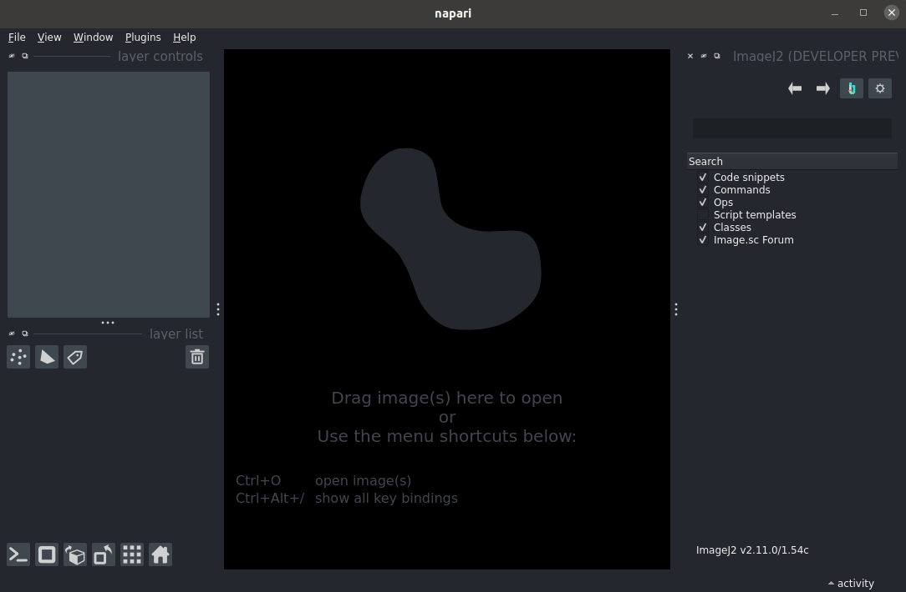
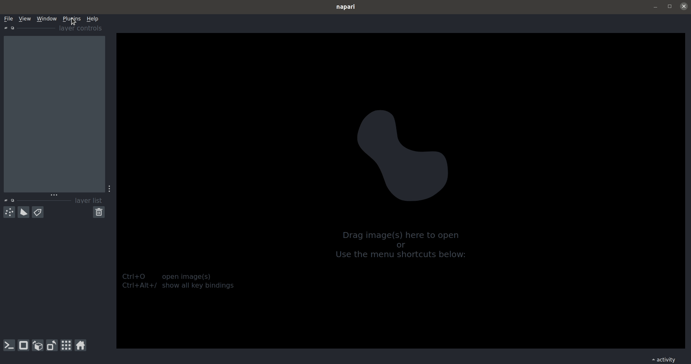

Object Tracking with TrackMate
===========================================

The `TrackMate`_ plugin for ImageJ2 provides a streamlined interface for object tracking. This use case shows how we can use napari-imagej to run TrackMate on data from napari.

Installation
------------

By default, napari-imagej does not include Fiji *or* TrackMate. To access TrackMate, we must first configure napari-imagej to enable TrackMate access.

We can configure napari-imagej to use a Fiji installation by opening the settings dialog and changing ``imagej distribution_or_endpoint`` (described `here <../Configuration.html#imagej-directory-or-endpoint>`_) to ``sc.fiji:fiji``.

    Configuring napari-imagej to use Fiji instead of pure ImageJ2. With Fiji, we gain access to many popular plugins, including TrackMate.

**Note that napari must be restarted for these changes to take effect!**

Launching TrackMate
-------------------

Once napari-imagej is running again, open the ImageJ UI from the napari-imagej menu. The ImageJ UI is necessary as TrackMate can only run on data displayed within the ImageJ UI.

If you want to run TrackMate on data within napari, you can use the data transfer buttons in the napari-imagej menu to move that data into the ImageJ UI.

Additionally, you can open your data through ``File>Open...`` in the ImageJ UI, or by dropping your data on the ImageJ UI.

..  We might want to consider a better gif here later, ESPECIALLY if we link users to some example data.

    Once the ImageJ UI is visible, data can be transferred between the user interfaces with the data transfer buttons, located in the napari-imagej menu.

With your data open, you can launch TrackMate through ``Plugins>Tracking>Trackmate``. For information on running TrackMate, we defer to `one of the many guides <https://imagej.net/plugins/trackmate/#documentation-and-tutorials>`_ on the ImageJ Wiki.

.. _TrackMate: https://imagej.net/plugins/trackmate